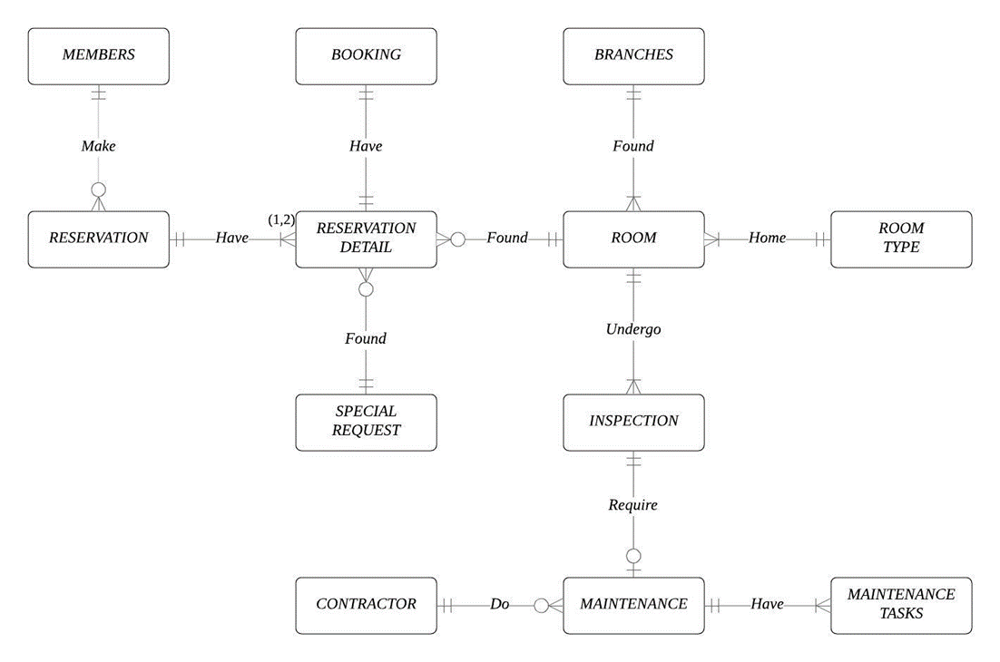

# Hotel Database System Design

Create a SQL database system using Oracle for the assignment of Database Fundamentals (SEG1201)

## File Structure
- `resort.sql` => Script to create the tables following the [erd design](#erd-design)
- `query.sql` => Script to query and select from the tables in `resort.sql`

## ERD Design
